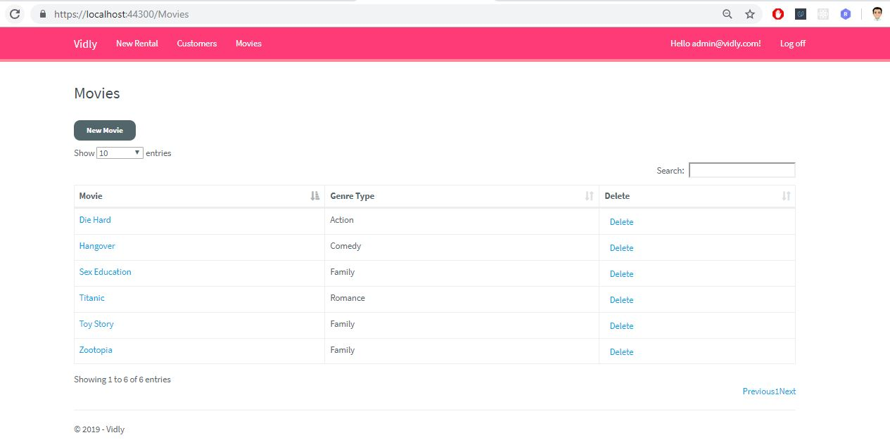
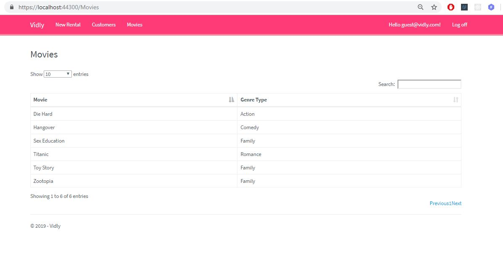
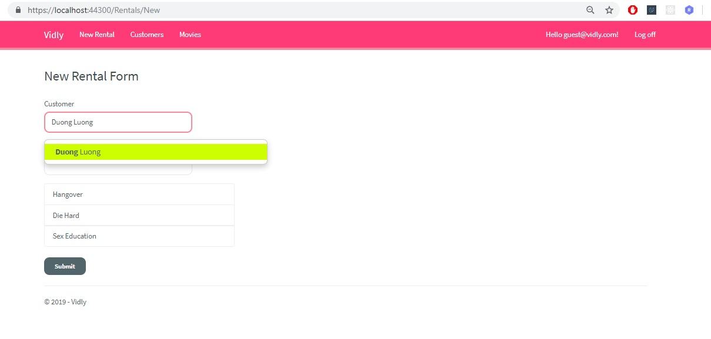

# MyShop
Vidly Video Rental Demo Project

## Table of Contents

* [Description](#Description)
* [Dependencies](#Dependencies)

## Description

This project is Video Rental Project named Vidly which is created based on ASP.NET MVC5. This web application allows users login or register to rent any movies that they want. 

The following photo is the Login page:

Movies Page by admin login:

Movies Page by guest login:

Rental Page:

## Dependencies

The project is cooperated with a framework is ASP.NET MVC5, a JavaScript framework is Bootstrap, Jquery, AutoMapper and Entity Framework.
